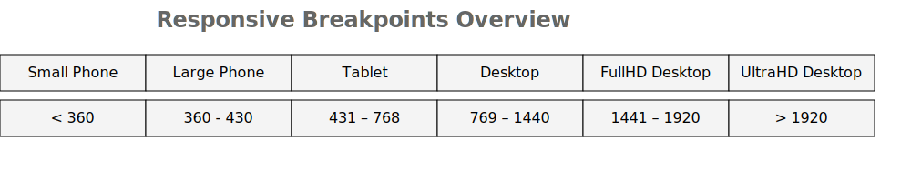

# Language/Sprache : [EN](RESPONSIVE_DESIGN_EN.md) | [DE](RESPONSIVE_DESIGN.md)
# 📱 Responsive Design Patterns in Flutter mit Custom Breakpoints

Flutter ist eine UI-Toolkit-Plattform, die auf vielen Geräten läuft – von kleinen Phones bis hin zu großen Desktops. Um nutzerfreundliche und skalierbare Layouts zu schaffen, ist **Responsive Design** essenziell.

Dieses Dokumentation zeigt ein **eigenes Breakpoint-System** mithilfe von **Dart-Extensions** für `BuildContext` und 
`Widget`.

---

## 🧠 1. Warum Responsive Design?

Responsive Design ermöglicht:
- Konsistente Benutzererfahrung über verschiedene Bildschirmgrößen hinweg
- Dynamische Layouts, angepasst an Gerätetypen
- Wartbare und anpassbare UI-Strukturen

---

## 🎯 2. Was ist ein Breakpoint-System?

Ein **Breakpoint** ist eine definierte Bildschirmbreite, bei der das Layout angepasst wird. Typische Kategorien:

### 📐 Typische Breakpoint-Größen (in Pixeln)

| Gerätetyp                      | Beschreibung                   | Typische Breite (px)   |
| ------------------------------ | ------------------------------ | ---------------------- |
| **Kleines Smartphone**         | Z. B. iPhone SE, ältere Geräte | `≤ 360`–`412` px       |
| **Großes Smartphone**          | Aktuelle iPhones, Pixel, etc.  | `≥ 413` – `≤ 576` px   |
| **Tablet (Hochkant)**          | iPad, Galaxy Tab (portrait)    | `≥ 577` – `≤ 768` px   |
| **Tablet (Querformat)**        | iPad landscape                 | `≈ 800` – `1024` px    |
| **Kleiner Desktop / Notebook** | 13–15″ Geräte                  | `≥ 992` – `≤ 1366` px  |
| **Full HD Desktop**            | Standard 1080p Monitore        | `≥ 1366` – `≤ 1920` px |
| **4K Desktop**                 | UHD-Displays, große Screens    | `> 1920` – `3840` px   |


>### 🧠 Hinweise:
>- Geräte wie das iPhone 14 Pro Max haben eine physische Breite von z. B. 430 px (logical pixels in Flutter).
>- Flutter verwendet logical pixels (nicht echte Bildschirmpixel), was Breakpoints geräteunabhängig stabil macht.
>- Wenn du z. B. MediaQuery.of(context).size.width verwendest, bekommst du logical width, die bereits skaliert ist.

> So wird sichergestellt, dass Inhalte auf einem kleinen Gerät nicht überladen und auf einem großen Gerät nicht leer wirken.



### ✅ Empfohlene eigene Breakpoints für Flutter (anpassbar):
```dart
class Breakpoints {
  static const double smallPhone = 360;
  static const double largePhone = 430;
  static const double tablet = 768;
  static const double desktop = 1024;
  static const double fullHD = 1440;
  static const double ultraHD = 1920;
}
```


## 🧩 3. Dart Extensions: Kurz erklärt

Dart-**Extensions** ermöglichen es, bestehende Klassen wie `BuildContext` oder `Widget` **funktional zu erweitern**, ohne sie zu erben.

Beispiel:

```dart
extension ResponsiveContext on BuildContext {
  double get width => MediaQuery.of(this).size.width;
}
```
Ergebnis:
```dart
final screenWidth = context.width;
```

## 🏗️ 4. Klassen und Extensions
### 🔹 Breakpoints
Definiert feste Grenzwerte (z. B. Breakpoints.tablet) für die responsive Entscheidung.

```dart
class Breakpoints {
  static const double tablet = 768;
  // ...
}
```

### 🔹 DeviceType & ResponsiveContext
Ermöglicht einfache Device-Erkennung:

```dart
if (context.isTabletOrLarger) {
  // Desktop-Layout
}
```

#### Weitere Getter:

- isMobile, isTablet, isDesktop, deviceType
- responsive<T>(...) für Wertauswahl nach DeviceType
- isDarkMode, isLightMode

### 🔹 ResponsiveWidget Extension
Macht Widgets sichtbar/unsichtbar je nach DeviceType oder fügt dynamisch padding, margin, constraints hinzu:

```dart
Text("Hello").showOnMobile(context)
Container().responsivePadding(context, mobile: EdgeInsets.all(8))
```

### 🔹 ResponsiveSize Utility
Berechnet dynamisch Größen, z. B. für Text oder Prozentangaben:
```dart
Text(
  "Headline",
  style: TextStyle(fontSize: ResponsiveSize.fontSize(context, desktop: 24, mobile: 16, defaultSize: 18)),
)
```

### 🔹 ResponsiveBuilder
Flexible Variante eines Builders für unterschiedliche Devices:
```dart
ResponsiveBuilder(
  tablet: TabletLayout(),
  desktop: DesktopLayout(),
  defaultWidget: MobileLayout(),
)
```
oder dynamisch:
```dart
builder: (context, deviceType) {
if (deviceType == DeviceType.desktop) return DesktopView();
return MobileView();
}
```
## ✅ 5. Best Practices

| Empfehlung                                   | Beschreibung                                   |
| -------------------------------------------- | ---------------------------------------------- |
| 📐 Klare Breakpoint-Definition               | Nutze konstante Werte für Wiederverwendbarkeit |
| ♻️ Extensions nutzen                         | Verbessert Lesbarkeit und Struktur             |
| ⚖️ Nicht zu viele Layout-Versionen           | Halte Tablet/Desktop gemeinsam, wenn möglich   |
| 💡 responsive(...) statt if-else             | Vermeidet redundanten Code                     |
| 📦 `ResponsiveBuilder` für große Komponenten | Ersetzt manuelles Switchen in der View         |


## 🧾 6. Zusammenfassung
Dieses System bietet:

- Klar strukturierte Gerätelogik durch DeviceType
- Flexible UI-Komponenten, steuerbar durch Extensions
- Wiederverwendbare Utilities für Layout, Textgrößen, Paddings
- Ideal für mittlere bis große Projekte, bei denen Responsivität nicht optional ist.

## Zurück zum Inhalt:
[Zurück zum Startpunkt](../README.md)
