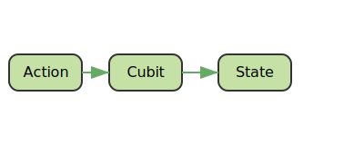
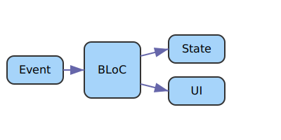

# Language/Sprache : [EN](STATEMANAGEMENT_BLOC_EN.md) | [DE](STATEMANAGEMENT_BLOC.md)
# 📦 Flutter State Management mit BLoC Pattern

Flutter bietet viele Möglichkeiten zum State Management. Eines der etabliertesten Muster ist das **BLoC Pattern**, welches besonders bei mittleren bis großen Projekten für klare Trennung von Logik und UI sorgt.

---

## 📚 1. Grundlagen des State Managements

In Flutter bedeutet "State Management", wie sich UI-Komponenten bei Änderungen im Datenmodell (State) verhalten. Es gibt **zwei Hauptarten**:

- **Local State**: State ist an ein Widget gebunden (z. B. `setState()`).
- **Global State**: State wird über mehrere Widgets hinweg geteilt und verwaltet.

Ziel eines effektiven State Managements:
- **Vorhersagbarkeit**
- **Wiederverwendbarkeit**
- **Testbarkeit**

---

## 🧱 2. Was ist BLoC und das BLoC Pattern?

**BLoC = Business Logic Component**

Das BLoC Pattern basiert auf dem Prinzip von:
- **Input (Event)** → **BLoC verarbeitet** → **Output (State)**

### Vorteile:
- Klare Trennung von UI und Logik
- Hohe Testbarkeit
- Wiederverwendbare Logik

---

## 🔀 3. Unterschied zwischen `Cubit` und `Bloc`

| Merkmal | `Cubit` | `Bloc` |
|--------|--------|--------|
| API | Einfacher | Event/State basiert |
| Eingabe | Methodenaufrufe | Events |
| Kontrolle | Direkt | Automatisiert über Streams |
| Empfohlen für | Einfachere Logik | Komplexere Abläufe |

### Wann `Cubit` verwenden?
Wenn die State-Änderungen einfach und übersichtlich sind, z. B. Toggle, Counter, etc.

### Wann `Bloc` verwenden?
Bei komplexer Logik mit mehreren Events, wie z. B. Formularvalidierung, Netzwerkoperationen, Authentifizierung.

---

## 🖼️ 4. SVG zur Veranschaulichung




> Diese Grafik zeigt den Fluss von Event → Bloc → State → UI.

---

## 🔧 5. Codebeispiele

### 🟢 Cubit Beispiel: Button Counter

```dart
// counter_cubit.dart
import 'package:flutter_bloc/flutter_bloc.dart';

class CounterCubit extends Cubit<int> {
  CounterCubit() : super(0);

  void increment() => emit(state + 1);
}
```

```dart
// counter_view.dart
import 'package:flutter/material.dart';
import 'package:flutter_bloc/flutter_bloc.dart';
import 'counter_cubit.dart';

class CounterView extends StatelessWidget {
  @override
  Widget build(BuildContext context) {
    return BlocProvider(
      create: (_) => CounterCubit(),
      child: Scaffold(
        appBar: AppBar(title: Text("Cubit Counter")),
        body: Center(
          child: BlocBuilder<CounterCubit, int>(
            builder: (context, count) => Text('$count', style: TextStyle(fontSize: 40)),
          ),
        ),
        floatingActionButton: FloatingActionButton(
          onPressed: () => context.read<CounterCubit>().increment(),
          child: Icon(Icons.add),
        ),
      ),
    );
  }
}
```

### 🟣 Bloc Beispiel: Textfeld mit Validierung
```dart
// validation_event.dart
abstract class ValidationEvent {}

class TextChanged extends ValidationEvent {
  final String input;
  TextChanged(this.input);
}
```

```dart
// validation_state.dart
abstract class ValidationState {}

class Valid extends ValidationState {}

class Invalid extends ValidationState {}

```

```dart
// validation_bloc.dart
import 'package:flutter_bloc/flutter_bloc.dart';
import 'validation_event.dart';
import 'validation_state.dart';

class ValidationBloc extends Bloc<ValidationEvent, ValidationState> {
  ValidationBloc() : super(Invalid()) {
    on<TextChanged>((event, emit) {
      // valide wenn min 4 Zeichen lang
      if (event.input.length >= 4) {
        emit(Valid());
      } else {
        emit(Invalid());
      }
    });
  }
}
```
```dart
// validation_view.dart
import 'package:flutter/material.dart';
import 'package:flutter_bloc/flutter_bloc.dart';
import 'validation_bloc.dart';
import 'validation_event.dart';
import 'validation_state.dart';

class ValidationView extends StatelessWidget {
  @override
  Widget build(BuildContext context) {
    return BlocProvider(
      create: (_) => ValidationBloc(),
      child: Scaffold(
        appBar: AppBar(title: Text("Bloc Text Validation")),
        body: Padding(
          padding: EdgeInsets.all(16),
          child: Column(
            children: [
              BlocBuilder<ValidationBloc, ValidationState>(
                builder: (context, state) => TextField(
                  onChanged: (input) => context.read<ValidationBloc>().add(TextChanged(input)),
                  decoration: InputDecoration(
                    labelText: "Eingabe",
                    errorText: state is Invalid ? "Mind. 4 Zeichen" : null,
                  ),
                ),
              ),
            ],
          ),
        ),
      ),
    );
  }
}
```

## ✅ 6. Zusammenfassung & Best Practices
Vorteile des BLoC Patterns:
- Gute Trennung von UI & Logik
- Hohe Testbarkeit
- Sauberer Datenfluss

Best Practices:
- Verwende Cubit für einfache Logik
- Verwende Bloc für komplexe, eventbasierte Interaktionen
- Nutze BlocBuilder selektiv, um Performance zu verbessern
- Halte States und Events schlank und lesbar
- Verwende Freezed und Equatable für Value Equality

## 🧮 7. BLoC mit Equatable – Was ist das und warum?
In Flutter BLoC ist es wichtig, dass sich der Zustand korrekt vergleicht – besonders für BlocBuilder, der nur neu baut, wenn sich der Zustand verändert.

### ❓ Was ist Equatable?
Equatable ist ein Dart-Package, das es dir erlaubt, Objekte nach Wert (value equality) zu vergleichen, statt nach Referenz (default Verhalten in Dart).

ohne Equatable:
```dart
class CounterState {
  final int count;
  CounterState(this.count);
}

// Zwei Instanzen mit gleichem Wert sind !=
CounterState(1) == CounterState(1); // false
```

mit Equatable:
```dart
import 'package:equatable/equatable.dart';

class CounterState extends Equatable {
  final int count;
  const CounterState(this.count);

  @override
  List<Object> get props => [count];
}

// Zwei Instanzen mit gleichem Wert sind == bzw. equal
CounterState(1) == CounterState(1); // false
```

### ✅ Warum ist das wichtig?
- BlocBuilder verwendet == um zu entscheiden, ob die UI neu gebaut werden muss.
- Ohne Equatable wird BlocBuilder immer neu gebaut – selbst bei gleichem State-Inhalt.
- Du vermeidest unnötige Rebuilds → bessere Performance.

### 🧠 Best Practice:
- Alle States sollten Equatable oder freezed verwenden.
- Immer props korrekt definieren – alles, was sich auf Equality auswirkt, muss rein.
- Bei const Konstruktoren kann Dart zusätzlich optimieren.


### 📦 Beispiel mit Equatable im BLoC
```dart
// state.dart
import 'package:equatable/equatable.dart';

class LoginState extends Equatable {
  final bool isValid;
  const LoginState({required this.isValid});

  @override
  List<Object> get props => [isValid];
}
```
```dart
// bloc.dart
import 'package:flutter_bloc/flutter_bloc.dart';
import 'state.dart';

class LoginCubit extends Cubit<LoginState> {
  LoginCubit() : super(LoginState(isValid: false));

  void validate(String email) {
    emit(LoginState(isValid: email.contains("@")));
  }
}
```

>📌 Fazit:
> 
>Mit Equatable sorgst du dafür, dass deine BLoC-States korrekt verglichen werden – das verbessert sowohl Performance 
> als auch Logik-Klarheit.

## 📎 Weiterführende Links
- [flutter_bloc package](https://pub.dev/packages/flutter_bloc)
- [Bloc Documentation](https://bloclibrary.dev/) 
- [Freezed für States & Events](https://pub.dev/packages/freezed)

## Zurück zum Inhalt:
[Zurück zum Startpunkt](../README.md)
