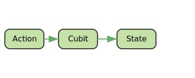

# Sprache/Language : [DE](STATEMANAGEMENT_BLOC.md) | [EN](STATEMANAGEMENT_BLOC_EN.md)
# 📦 Flutter State Management with BLoC Pattern

Flutter offers many possibilities for state management. One of the most established patterns is the **BLoC Pattern**, which provides clear separation of logic and UI, especially for medium to large projects.

---

## 📚 1. State Management Fundamentals

In Flutter, "State Management" means how UI components behave when changes occur in the data model (State). There are **two main types**:

- **Local State**: State is bound to a widget (e.g., `setState()`).
- **Global State**: State is shared and managed across multiple widgets.

Goals of effective state management:
- **Predictability**
- **Reusability**
- **Testability**

---

## 🧱 2. What is BLoC and the BLoC Pattern?

**BLoC = Business Logic Component**

The BLoC Pattern is based on the principle of:
- **Input (Event)** → **BLoC processes** → **Output (State)**

### Advantages:
- Clear separation of UI and logic
- High testability
- Reusable logic

---

## 🔀 3. Difference between `Cubit` and `Bloc`

| Feature | `Cubit` | `Bloc` |
|--------|--------|--------|
| API | Simpler | Event/State based |
| Input | Method calls | Events |
| Control | Direct | Automated via streams |
| Recommended for | Simpler logic | More complex workflows |

### When to use `Cubit`?
When state changes are simple and straightforward, e.g., Toggle, Counter, etc.

### When to use `Bloc`?
For complex logic with multiple events, such as form validation, network operations, authentication.

---

## 🖼️ 4. SVG for Illustration




> This graphic shows the flow of Event → Bloc → State → UI.

---

## 🔧 5. Code Examples

### 🟢 Cubit Example: Button Counter

```dart
// counter_cubit.dart
import 'package:flutter_bloc/flutter_bloc.dart';

class CounterCubit extends Cubit<int> {
  CounterCubit() : super(0);

  void increment() => emit(state + 1);
}
```

```dart
// counter_view.dart
import 'package:flutter/material.dart';
import 'package:flutter_bloc/flutter_bloc.dart';
import 'counter_cubit.dart';

class CounterView extends StatelessWidget {
  @override
  Widget build(BuildContext context) {
    return BlocProvider(
      create: (_) => CounterCubit(),
      child: Scaffold(
        appBar: AppBar(title: Text("Cubit Counter")),
        body: Center(
          child: BlocBuilder<CounterCubit, int>(
            builder: (context, count) => Text('$count', style: TextStyle(fontSize: 40)),
          ),
        ),
        floatingActionButton: FloatingActionButton(
          onPressed: () => context.read<CounterCubit>().increment(),
          child: Icon(Icons.add),
        ),
      ),
    );
  }
}
```

### 🟣 Bloc Example: Text Field with Validation
```dart
// validation_event.dart
abstract class ValidationEvent {}

class TextChanged extends ValidationEvent {
  final String input;
  TextChanged(this.input);
}
```

```dart
// validation_state.dart
abstract class ValidationState {}

class Valid extends ValidationState {}

class Invalid extends ValidationState {}

```

```dart
// validation_bloc.dart
import 'package:flutter_bloc/flutter_bloc.dart';
import 'validation_event.dart';
import 'validation_state.dart';

class ValidationBloc extends Bloc<ValidationEvent, ValidationState> {
  ValidationBloc() : super(Invalid()) {
    on<TextChanged>((event, emit) {
      // valid if at least 4 characters long
      if (event.input.length >= 4) {
        emit(Valid());
      } else {
        emit(Invalid());
      }
    });
  }
}
```
```dart
// validation_view.dart
import 'package:flutter/material.dart';
import 'package:flutter_bloc/flutter_bloc.dart';
import 'validation_bloc.dart';
import 'validation_event.dart';
import 'validation_state.dart';

class ValidationView extends StatelessWidget {
  @override
  Widget build(BuildContext context) {
    return BlocProvider(
      create: (_) => ValidationBloc(),
      child: Scaffold(
        appBar: AppBar(title: Text("Bloc Text Validation")),
        body: Padding(
          padding: EdgeInsets.all(16),
          child: Column(
            children: [
              BlocBuilder<ValidationBloc, ValidationState>(
                builder: (context, state) => TextField(
                  onChanged: (input) => context.read<ValidationBloc>().add(TextChanged(input)),
                  decoration: InputDecoration(
                    labelText: "Input",
                    errorText: state is Invalid ? "Min. 4 characters" : null,
                  ),
                ),
              ),
            ],
          ),
        ),
      ),
    );
  }
}
```

## ✅ 6. Summary & Best Practices
Advantages of the BLoC Pattern:
- Good separation of UI & logic
- High testability
- Clean data flow

Best Practices:
- Use Cubit for simple logic
- Use Bloc for complex, event-based interactions
- Use BlocBuilder selectively to improve performance
- Keep States and Events lean and readable
- Use Freezed and Equatable for Value Equality

## 🧮 7. BLoC with Equatable – What is it and why?
In Flutter BLoC, it's important that the state compares correctly – especially for BlocBuilder, which only rebuilds when the state changes.

### ❓ What is Equatable?
Equatable is a Dart package that allows you to compare objects by value (value equality) instead of reference (default behavior in Dart).

without Equatable:
```dart
class CounterState {
  final int count;
  CounterState(this.count);
}

// Two instances with the same value are !=
CounterState(1) == CounterState(1); // false
```

with Equatable:
```dart
import 'package:equatable/equatable.dart';

class CounterState extends Equatable {
  final int count;
  const CounterState(this.count);

  @override
  List<Object> get props => [count];
}

// Two instances with the same value are == or equal
CounterState(1) == CounterState(1); // true
```

### ✅ Why is this important?
- BlocBuilder uses == to decide whether the UI needs to be rebuilt.
- Without Equatable, BlocBuilder always rebuilds – even with the same state content.
- You avoid unnecessary rebuilds → better performance.

### 🧠 Best Practice:
- All States should use Equatable or freezed.
- Always define props correctly – everything that affects equality must be included.
- With const constructors, Dart can additionally optimize.


### 📦 Example with Equatable in BLoC
```dart
// state.dart
import 'package:equatable/equatable.dart';

class LoginState extends Equatable {
  final bool isValid;
  const LoginState({required this.isValid});

  @override
  List<Object> get props => [isValid];
}
```
```dart
// bloc.dart
import 'package:flutter_bloc/flutter_bloc.dart';
import 'state.dart';

class LoginCubit extends Cubit<LoginState> {
  LoginCubit() : super(LoginState(isValid: false));

  void validate(String email) {
    emit(LoginState(isValid: email.contains("@")));
  }
}
```

>📌 Conclusion:
>
>With Equatable, you ensure that your BLoC states are correctly compared – this improves both performance
> and logic clarity.

## 📎 Further Links
- [flutter_bloc package](https://pub.dev/packages/flutter_bloc)
- [Bloc Documentation](https://bloclibrary.dev/)
- [Freezed for States & Events](https://pub.dev/packages/freezed)

## Back to Content:
[Back to Starting Point](../README_EN.md)