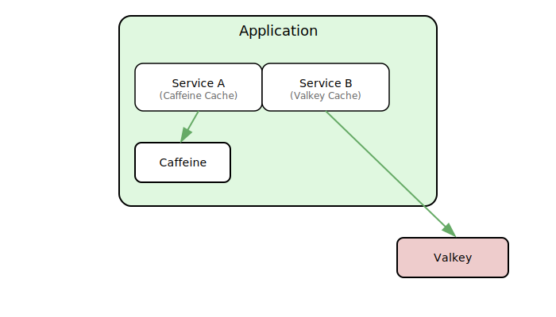

# Language/Sprache : [EN](CACHING_INTRO_EN.md) | [DE](CACHING_INTRO.md)

# 🚀 Caching mit Spring Boot und Kotlin: Von Caffeine zu Redis (Valkey)

## 🧠 Einleitung: Warum Caching?

Caching ist eine Technik zur temporären Speicherung von Daten, um die Antwortzeiten zu verkürzen und die Last auf Datenbanken oder externe Systeme zu reduzieren. In Spring Boot lässt sich Caching durch einfache Annotationen aktivieren und flexibel anpassen.

Typische Vorteile:
- Schnellere Ladezeiten
- Reduzierte Datenbankzugriffe
- Höhere Skalierbarkeit

---

## ☕ Was ist Caffeine?

[Caffeine](https://github.com/ben-manes/caffeine) ist ein moderner, hochperformanter In-Memory-Cache für Java. Er bietet:
- automatische Entfernung von Einträgen durch Größe oder Zeit
- asynchrone Ladefunktionen
- Near-optimal Hit-Rates durch ausgeklügelte Algorithmen

**Vorteil**: Ideal für schnellen, lokalen Cache im Speicher (z. B. Web-Session-Daten, häufig abgefragte DTOs).

---

## 🔥 Was ist Redis bzw. Valkey?

**Redis** ist ein In-Memory-Datenspeicher mit optionaler Persistenz, der oft als Cache oder Message Broker genutzt 
wird. **Valkey** ist ein Fork von Redis, entwickelt als Open-Source-Alternative, seit Redis 7.2 unter einer 
Business-Lizenz steht, während ab Version 8 wieder eine freie Version verfügbar ist.

Beide bieten:
- Key-Value-Storage
- Datenstrukturunterstützung (Listen, Sets, Hashes etc.)
- TTL (Time-To-Live) pro Key
- Unterstützung für Clustering und Replikation

**Einsatzgebiet**: Ideal für verteilte Caches oder langlebige Daten, die über mehrere Instanzen hinweg geteilt werden sollen.

### ⚙️ Abstraktes Architekturbild


---

## 🧪 Erste Schritte mit Caffeine (In-Memory)

### 📦 Abhängigkeiten (`build.gradle.kts`)

```kotlin
dependencies {
    implementation("org.springframework.boot:spring-boot-starter-cache")
    implementation("com.github.ben-manes.caffeine:caffeine")
}
```

### ⚙️ Konfiguration (CacheConfig.kt)
```kotlin
@Configuration
@EnableCaching
class CacheConfig {
    @Bean
    fun caffeineCacheManager(): CacheManager {
        val caffeine: Caffeine<Any, Any> = Caffeine.newBuilder()
            .expireAfterWrite(10, TimeUnit.MINUTES)
            .maximumSize(100)

        return CaffeineCacheManager().apply {
            setCaffeine(caffeine)
        }
    }
}
```

### 🧩 Beispielnutzung mit @Cacheable, @CachePut, @CacheEvict
```kotlin
@Service
class UserService {

    @Cacheable("users")
    fun getUserById(id: Long): User {
        println("Fetching user $id from DB")
        return fetchUserFromDb(id)
    }

    @CachePut("users")
    fun updateUser(id: Long, updatedUser: User): User {
        println("Updating user $id and refreshing cache")
        return saveUserToDb(updatedUser)
    }

    @CacheEvict("users")
    fun deleteUser(id: Long) {
        println("Deleting user $id and evicting from cache")
        deleteUserFromDb(id)
    }
}
```

## 🗄️ Long-Term Caching mit Redis / Valkey

### 📦 Abhängigkeiten (build.gradle.kts)
```kotlin
dependencies {
    implementation("org.springframework.boot:spring-boot-starter-data-redis")
    implementation("org.springframework.boot:spring-boot-starter-cache")
    implementation("com.fasterxml.jackson.module:jackson-module-kotlin")
}
```

### ⚙️ Redis / Valkey-Konfiguration (application.yml)
```yaml
spring:
  cache:
    type: redis
  data:
    redis:
      host: localhost
      port: 6379
```

### 🔧 Redis / Valkey CacheManager-Konfiguration
```kotlin
@Configuration
@EnableCaching
class RedisCacheConfig {
    @Bean
    fun cacheManager(redisConnectionFactory: RedisConnectionFactory): CacheManager {
        val config = RedisCacheConfiguration.defaultCacheConfig()
            .entryTtl(Duration.ofMinutes(60))
            .disableCachingNullValues()
            .serializeValuesWith(
                RedisSerializationContext.SerializationPair.fromSerializer(
                    GenericJackson2JsonRedisSerializer()
                )
            )
        return RedisCacheManager.builder(redisConnectionFactory)
            .cacheDefaults(config)
            .build()
    }
}
```

## 🧬 Multi-Level Caching (Caffeine + Redis)

### 💡 Ziel

Kombination von:
- Caffeine für schnellen Zugriff (Level 1)
- Redis / Valkey für langlebige, verteilte Speicherung (Level 2)

Spring Boot unterstützt Multi-Level-Caching nicht out-of-the-box – dafür gibt es Drittanbieter, oder du baust es selbst über eine kombinierte CacheManager-Strategie.

### 🛠 Beispiel mit manuellem Kombi-Ansatz (fortgeschritten)
```kotlin
@Configuration
@EnableCaching
class MultiLevelCacheConfig {

    @Bean
    @Qualifier("caffeine")
    fun caffeineManager(): CacheManager {
        val caffeine = Caffeine.newBuilder()
            .expireAfterWrite(10, TimeUnit.MINUTES)
            .maximumSize(100)
        return CaffeineCacheManager().apply { setCaffeine(caffeine) }
    }

    @Bean
    @Qualifier("redis")
    fun redisManager(redisConnectionFactory: RedisConnectionFactory): CacheManager {
        val config = RedisCacheConfiguration.defaultCacheConfig()
            .entryTtl(Duration.ofMinutes(60))
        return RedisCacheManager.builder(redisConnectionFactory)
            .cacheDefaults(config)
            .build()
    }

    // Kombinierter CacheManager wäre ein Custom Bean, z. B. delegierend oder mit Fallback
}
```
>⚠️ Hinweis: Wenn du mehrere CacheManager Beans definierst, brauchst du @Qualifier oder @Primary, um Konflikte zu 
> vermeiden.
> 
> Jedes der Beans hat den gleichen Typ, somit liesse sich das Bean via Type nicht injecten, da es ohne @Qualifier 
> nicht eindeutig ist. 

## 🧹 Cache Invalidation Strategien

| Strategie                   | Beschreibung                                            |
| --------------------------- | ------------------------------------------------------- |
| **Time-To-Live (TTL)**      | Automatische Löschung nach bestimmter Zeit              |
| **@CacheEvict**             | Manuelles Entfernen bei Änderungen                      |
| **@Scheduled Clearing**     | Regelmäßige Bereinigung (z. B. täglich)                 |
| **Versionierter Cache-Key** | Bei Änderungen am Cache-Schema den Schlüssel umbenennen |
| **Cache per Request Scope** | Caches nur für eine kurze Session oder API-Aufruf       |

```kotlin
@Scheduled(cron = "0 0 3 * * *") // Täglich 03:00
@CacheEvict(value = ["users"], allEntries = true)
fun clearUserCacheNightly() {
    println("Nachtbereinigung des User-Caches")
}
```

## 📊 Monitoring mit Spring Boot Actuator
### 📦 Abhängigkeiten
```kotlin
dependencies {
    implementation("org.springframework.boot:spring-boot-starter-actuator")
}
```
### ⚙️ Aktivierung in application.yml
```yaml
management:
  endpoints:
    web:
      exposure:
        include: "*"
  endpoint:
    caches:
      enabled: true
```
>💡Hinweis: exposure.include: *, nur für Test- oder Entwicklung nutzen, wir wollen nicht alle endpoints per Default 
> exposen!

### 🔍 Cache-Monitoring-Endpunkt

```
GET http://localhost:8080/actuator/caches
```

Beispielergebnis:
```json
{
  "cacheManagers": {
    "cacheManager": {
      "cacheNames": [
        "users",
        "products"
      ]
    }
  }
}
```

## ✅ Best Practices
- Verwende @CacheEvict in Änderungsservices
- Kombiniere Cache-Ebenen bewusst, z. B. für Performance + Persistenz
- Nutze @Scheduled oder Cache-Statistiken zur Überwachung
- Vermeide das Caching großer Objekte (Blob, große Listen etc.)
- Nutze Profil-spezifische CacheManager, z. B. nur Redis in Produktion

## 🧾 Zusammenfassung

| Tool       | Typ         | Vorteil                         | Nachteil                    |
| ---------- | ----------- | ------------------------------- | --------------------------- |
| Caffeine   | In-Memory   | Schnell, lokal, einfach         | Nicht verteilt, flüchtig    |
| Redis      | Remote      | Langlebig, verteilt, skalierbar | Netzwerklatenz, Setup nötig |
| Kombiniert | Multi-Level | Performance + Persistenz        | Custom-Logik nötig          |


## 🧩 Nächste Schritte
- Implementiere Multi-Level-CacheManager
- Messe Hit-Rates mit Micrometer/Prometheus
- Teste Caching mit Integrationstests (@SpringBootTest)

## Zurück zum Inhalt:
[Zurück zum Startpunkt](../README.md)
