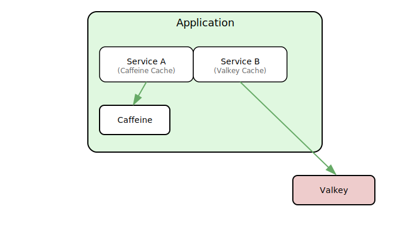

# Sprache/Language : [DE](CACHING_INTRO.md) | [EN](CACHING_INTRO_EN.md)

# 🚀 Caching with Spring Boot and Kotlin: From Caffeine to Redis (Valkey)

## 🧠 Introduction: Why Caching?

Caching is a technique for temporarily storing data to reduce response times and minimize load on databases or external systems. In Spring Boot, caching can be activated through simple annotations and flexibly customized.

Typical benefits:
- Faster loading times
- Reduced database access
- Higher scalability

---

## ☕ What is Caffeine?

[Caffeine](https://github.com/ben-manes/caffeine) is a modern, high-performance in-memory cache for Java. It offers:
- automatic removal of entries by size or time
- asynchronous loading functions
- near-optimal hit rates through sophisticated algorithms

**Advantage**: Ideal for fast, local cache in memory (e.g., web session data, frequently queried DTOs).

---

## 🔥 What is Redis or Valkey?

**Redis** is an in-memory data store with optional persistence, often used as a cache or message broker.
**Valkey** is a fork of Redis, developed as an open-source alternative since Redis 7.2 is under a
business license, while version 8 and later are available under a free license again.

Both offer:
- Key-value storage
- Data structure support (lists, sets, hashes, etc.)
- TTL (Time-To-Live) per key
- Support for clustering and replication

**Use case**: Ideal for distributed caches or long-lived data that should be shared across multiple instances.

### ⚙️ Abstract Architecture Diagram


---

## 🧪 Getting Started with Caffeine (In-Memory)

### 📦 Dependencies (`build.gradle.kts`)

```kotlin
dependencies {
    implementation("org.springframework.boot:spring-boot-starter-cache")
    implementation("com.github.ben-manes.caffeine:caffeine")
}
```

### ⚙️ Configuration (CacheConfig.kt)
```kotlin
@Configuration
@EnableCaching
class CacheConfig {
    @Bean
    fun caffeineCacheManager(): CacheManager {
        val caffeine: Caffeine<Any, Any> = Caffeine.newBuilder()
            .expireAfterWrite(10, TimeUnit.MINUTES)
            .maximumSize(100)

        return CaffeineCacheManager().apply {
            setCaffeine(caffeine)
        }
    }
}
```

### 🧩 Example Usage with @Cacheable, @CachePut, @CacheEvict
```kotlin
@Service
class UserService {

    @Cacheable("users")
    fun getUserById(id: Long): User {
        println("Fetching user $id from DB")
        return fetchUserFromDb(id)
    }

    @CachePut("users")
    fun updateUser(id: Long, updatedUser: User): User {
        println("Updating user $id and refreshing cache")
        return saveUserToDb(updatedUser)
    }

    @CacheEvict("users")
    fun deleteUser(id: Long) {
        println("Deleting user $id and evicting from cache")
        deleteUserFromDb(id)
    }
}
```

## 🗄️ Long-Term Caching with Redis / Valkey

### 📦 Dependencies (build.gradle.kts)
```kotlin
dependencies {
    implementation("org.springframework.boot:spring-boot-starter-data-redis")
    implementation("org.springframework.boot:spring-boot-starter-cache")
    implementation("com.fasterxml.jackson.module:jackson-module-kotlin")
}
```

### ⚙️ Redis / Valkey Configuration (application.yml)
```yaml
spring:
  cache:
    type: redis
  data:
    redis:
      host: localhost
      port: 6379
```

### 🔧 Redis / Valkey CacheManager Configuration
```kotlin
@Configuration
@EnableCaching
class RedisCacheConfig {
    @Bean
    fun cacheManager(redisConnectionFactory: RedisConnectionFactory): CacheManager {
        val config = RedisCacheConfiguration.defaultCacheConfig()
            .entryTtl(Duration.ofMinutes(60))
            .disableCachingNullValues()
            .serializeValuesWith(
                RedisSerializationContext.SerializationPair.fromSerializer(
                    GenericJackson2JsonRedisSerializer()
                )
            )
        return RedisCacheManager.builder(redisConnectionFactory)
            .cacheDefaults(config)
            .build()
    }
}
```

## 🧬 Multi-Level Caching (Caffeine + Redis)

### 💡 Goal

Combination of:
- Caffeine for fast access (Level 1)
- Redis / Valkey for long-lived, distributed storage (Level 2)

Spring Boot doesn't support multi-level caching out-of-the-box – there are third-party solutions, or you can build it yourself using a combined CacheManager strategy.

### 🛠 Example with Manual Combined Approach (Advanced)
```kotlin
@Configuration
@EnableCaching
class MultiLevelCacheConfig {

    @Bean
    @Qualifier("caffeine")
    fun caffeineManager(): CacheManager {
        val caffeine = Caffeine.newBuilder()
            .expireAfterWrite(10, TimeUnit.MINUTES)
            .maximumSize(100)
        return CaffeineCacheManager().apply { setCaffeine(caffeine) }
    }

    @Bean
    @Qualifier("redis")
    fun redisManager(redisConnectionFactory: RedisConnectionFactory): CacheManager {
        val config = RedisCacheConfiguration.defaultCacheConfig()
            .entryTtl(Duration.ofMinutes(60))
        return RedisCacheManager.builder(redisConnectionFactory)
            .cacheDefaults(config)
            .build()
    }

    // Combined CacheManager would be a custom bean, e.g., delegating or with fallback
}
```
>⚠️ Note: When you define multiple CacheManager beans, you need @Qualifier or @Primary to
> avoid conflicts.
>
> Each of the beans has the same type, so the bean could not be injected by type without @Qualifier
> since it's not unique.

## 🧹 Cache Invalidation Strategies

| Strategy                    | Description                                             |
| --------------------------- | ------------------------------------------------------- |
| **Time-To-Live (TTL)**      | Automatic deletion after a certain time                |
| **@CacheEvict**             | Manual removal upon changes                             |
| **@Scheduled Clearing**     | Regular cleanup (e.g., daily)                          |
| **Versioned Cache Key**     | Rename the key when cache schema changes               |
| **Cache per Request Scope** | Caches only for a short session or API call            |

```kotlin
@Scheduled(cron = "0 0 3 * * *") // Daily at 03:00
@CacheEvict(value = ["users"], allEntries = true)
fun clearUserCacheNightly() {
    println("Nightly cleanup of user cache")
}
```

## 📊 Monitoring with Spring Boot Actuator
### 📦 Dependencies
```kotlin
dependencies {
    implementation("org.springframework.boot:spring-boot-starter-actuator")
}
```
### ⚙️ Activation in application.yml
```yaml
management:
  endpoints:
    web:
      exposure:
        include: "*"
  endpoint:
    caches:
      enabled: true
```
>💡Note: exposure.include: *, only use for testing or development, we don't want to expose all endpoints by default!

### 🔍 Cache Monitoring Endpoint

```
GET http://localhost:8080/actuator/caches
```

Example result:
```json
{
  "cacheManagers": {
    "cacheManager": {
      "cacheNames": [
        "users",
        "products"
      ]
    }
  }
}
```

## ✅ Best Practices
- Use @CacheEvict in modification services
- Combine cache levels consciously, e.g., for performance + persistence
- Use @Scheduled or cache statistics for monitoring
- Avoid caching large objects (blobs, large lists, etc.)
- Use profile-specific CacheManagers, e.g., only Redis in production

## 🧾 Summary

| Tool       | Type        | Advantage                       | Disadvantage                |
| ---------- | ----------- | ------------------------------- | --------------------------- |
| Caffeine   | In-Memory   | Fast, local, simple             | Not distributed, volatile   |
| Redis      | Remote      | Long-lived, distributed, scalable | Network latency, setup required |
| Combined   | Multi-Level | Performance + persistence       | Custom logic required       |


## 🧩 Next Steps
- Implement multi-level CacheManager
- Measure hit rates with Micrometer/Prometheus
- Test caching with integration tests (@SpringBootTest)

## Back to Content:
[Back to Starting Point](../README_EN.md)