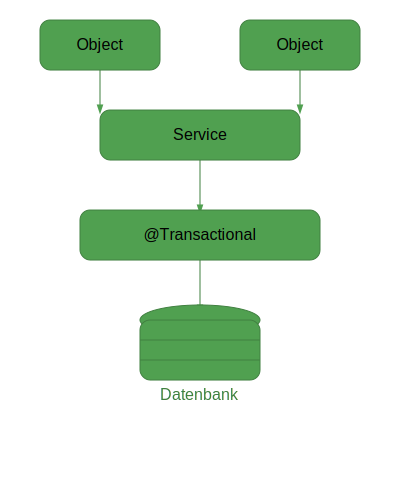

# Language/Sprache : [EN](SPRING_TRANSACTIONAL_EN.md) | [DE](SPRING_TRANSACTIONAL.md)

# Transaktionales Arbeiten mit `@Transactional` in Spring Boot 3.5+ und Kotlin

## Einleitung und Übersicht zu Transaktionen und `@Transactional`

Die Annotation `@Transactional` gehört zu den mächtigsten Werkzeugen in Spring Boot, wenn es um konsistente Datenbankoperationen geht. Sie stellt sicher, dass mehrere Schritte in einem Prozess atomar ausgeführt werden: entweder alle erfolgreich oder gar keiner.

Doch trotz ihrer Einfachheit in der Anwendung kann `@Transactional` unter der Haube einige tückische Fallstricke mit sich bringen – insbesondere im Zusammenspiel mit Spring AOP und Kotlin. Falsch verwendet, kann es dazu führen, dass Transaktionen **nicht aktiv sind**, ohne dass ein Fehler geworfen wird. In produktiven Systemen kann das zu **Dateninkonsistenz**, **Ressourcenblockaden** und **Systemausfällen** führen.



---

## Auswirkungen und Anwendung mit Beispielen

Ein klassischer Fehler ist die Verwendung von `@Transactional` an **privaten Methoden** innerhalb derselben Klasse:

```kotlin
@Service
class UserService(
    private val userRepository: UserRepository,
    private val emailClient: EmailClient
) {
    fun register(dto: UserDto) {
        saveUser(dto) // Kein Proxy-Aufruf → Keine Transaktion!
        emailClient.sendWelcomeEmail(dto.email)
    }

    @Transactional
    private fun saveUser(dto: UserDto) {
        val user = User(dto.email, dto.name)
        userRepository.save(user)
    }
}
```

➡️ ***Problem:*** Da Spring auf Proxies basiert, werden interne Methodenaufrufe innerhalb derselben Instanz nicht 
intercepted. Die Methode saveUser() wird also ohne Transaktion ausgeführt.

➡️ ***Folge:*** Keine Rollbacks bei Constraint-Verletzungen, Dirty Reads, unvollständige Datenzustände bei hoher Last.

***Korrekte Lösung:*** Transaktionen in separaten Beans

```kotlin
@Service
class UserPersistenceService(
    private val userRepository: UserRepository
) {
    @Transactional
    fun saveUser(dto: UserDto): User {
        val user = User(dto.email, dto.name)
        return userRepository.save(user)
    }
}

@Service
class UserService(
    private val persistence: UserPersistenceService,
    private val emailClient: EmailClient
) {
    fun register(dto: UserDto) {
        val user = persistence.saveUser(dto)
        emailClient.sendWelcomeEmail(user.email)
    }
}
```
➡️ ***Vorteil:*** Der Aufruf von saveUser() erfolgt über einen Spring-verwalteten Bean → Transaktion wird korrekt 
geöffnet.

---
## Don'ts – Was man nicht machen sollte
### Hier einige typische Fehlerquellen:

❌ Private oder interne Methoden mit @Transactional versehen
→ Transaktionen greifen nur über Spring-Proxies (also externe Aufrufe über Spring-Kontext)

❌ Externe I/O-Aufrufe innerhalb einer Transaktion (z.B. Email-Versand, HTTP, RabbitMQ, etc.)
→ Bei Timeouts oder Fehlern kann die gesamte Transaktion rückabgewickelt werden (z.B. Zahlung + Lagerbestand → Rollback)

❌ Blindes Vertrauen in @Transactional(propagation = REQUIRED)
→ Führt häufig zu übergreifenden Transaktionen, auch dort, wo man es gar nicht möchte (z.B. bei Benachrichtigungen)

Beispiel:

```kotlin
@Service
class OrderService(
    private val inventoryService: InventoryService,
    private val notificationService: NotificationService
) {
    @Transactional
    fun placeOrder(dto: OrderDto) {
        val order = createOrder(dto)
        inventoryService.reserveStock(order.items)
        notificationService.notifyCustomer(order) // Falscher Ort für Transaktion
    }
}
```
➡️ Bei einem Timeout im Mailserver wird die komplette Bestellung zurückgerollt, obwohl die Zahlung bereits erfolgt ist.

---
### Best Practices und Zusammenfassung

✅ Trennung von Orchestrierung und Persistenzlogik
→ Datenbankoperationen gehören in eigene, Spring-verwaltete Service-Beans

✅ Keine privaten Methoden mit @Transactional
→ Nur public-Methoden in Beans werden korrekt durch Spring-Proxies intercepted

✅ I/O außerhalb von Transaktionen ausführen
→ Verwende @Transactional(propagation = Propagation.NOT_SUPPORTED) für externe Aufrufe

```kotlin
@Transactional(propagation = Propagation.NOT_SUPPORTED)
fun notifyCustomer(order: Order) {
    notificationClient.send(order.customerEmail)
}
```

### ✅ Beobachtung der Systemmetriken mittels Logs und Actuators
#### → Überwache aktiv:

```yaml
logging:
  level:
    org.springframework.transaction: DEBUG
    org.hibernate.SQL: DEBUG
    com.zaxxer.hikari: DEBUG

management:
  endpoints:
    web:
      exposure:
        include: metrics,health
  metrics:
    export:
      prometheus:
        enabled: true
```

#### Beobachte insbesondere:

* hikari_connections_active
* spring_transactions_active
* spring_data_repository_invocations
---

## Fazit
Spring’s Transaktionsmanagement ist leistungsstark, aber nicht magisch. Wer die zugrunde liegende Proxy-Mechanik ignoriert, baut unsichtbare Bugs, die sich erst unter Last bemerkbar machen. Die Anwendung von @Transactional verlangt ein 
bewusstes Design der Applikationsstruktur – besonders bei Kotlin, wo Default-Methoden final sind und zusätzliche Vorsicht geboten ist.

> 🔒 Ein falsch platziertes @Transactional ist wie ein nicht eingerasteter Sicherheitsgurt: Du merkst es erst, wenn es zu spät ist.

## TLDR Checkliste

| Regel                                                                     | Beschreibung                                         |
|---------------------------------------------------------------------------| ---------------------------------------------------- |
| ✅ Öffentliche Methoden in Spring-Beans mit `@Transactional` versehen      | Nur so wirkt der Proxy korrekt                       |
| ✅ Externe Calls (z.B. Email, RabbitMQ) **nie** in Transaktionen einbetten | Verwende `Propagation.NOT_SUPPORTED`                 |
| ✅ Geschäftslogik trennen: Orchestrierung vs. Persistenz                   | Klare Service-Layer-Struktur                         |
| ✅ Überwache Transaktions- und Verbindungsmetriken                         | Frühzeitiges Erkennen von Bottlenecks                |
| ❌ Keine privaten oder internen Aufrufe von `@Transactional`-Methoden      | Sonst wird die Transaktion stillschweigend ignoriert |


## Zurück zum Inhalt:
[Zurück zum Startpunkt](../README.md)
