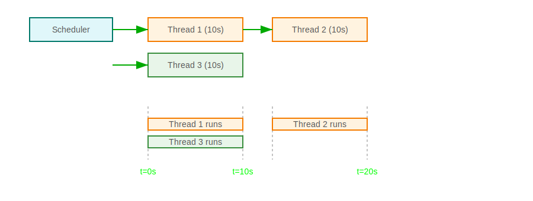

# Language/Sprache : [EN](VIRTUAL_THREADS_EN.md) | [DE](VIRTUAL_THREADS.md)

# Spring Boot 3.5+ – Concurrency, e.g. Scheduler with Virtual Threads (Kotlin, Java 21+)

## 📝 Introduction

This chapter shows a simple example of how to implement a recurring scheduler with **Spring Boot 3.5+**, **Kotlin**, 
and **Java 21+ Virtual Threads** that efficiently executes concurrent tasks. The results of the threads are collected and stored centrally – thread-safe with a `ConcurrentHashMap`.

---

## 🧵 What are Virtual Threads?

**Virtual Threads** are a feature from **Java 21** that provides lightweight threads decoupled from the JVM thread stack. They enable:

- Thousands of simultaneously running tasks with low memory usage
- Improved scalability without complex thread pools
- Particularly useful for I/O-intensive operations

Example:

```kotlin
Thread.startVirtualThread {
    println("I'm running as a Virtual Thread!")
}
```

## Concurrency in Spring Boot (Kotlin) with Semaphore & Virtual Threads
This subsection deepens the use of Semaphores, Virtual Threads (Java 21), and concurrency in Spring Boot with simple, practical examples. The "job runners" simulate time-intensive I/O operations (e.g., file access, network requests) with Thread.sleep.

### Prerequisites
* Spring Boot 3.2+
* JDK 21 (for Virtual Threads)
* Kotlin + Gradle, kotlin("plugin.spring") recommended (makes classes/methods open for proxies/AOP)

#### Basics: Concurrency short & sweet
Concurrency vs. Parallelism
Concurrency = tasks are processed overlapping (temporally interleaved).
Parallelism = tasks run simultaneously on multiple CPU cores.

Threads & Tasks
A task is the work unit, a thread is the execution unit. Executor services accept tasks and execute them on threads.

Blocking vs. Non-Blocking
I/O often blocks threads. With Virtual Threads, blocking becomes cheaper (fewer resources) without having to switch to
asynchronous callbacks.

### Synchronization Primitives

* Semaphore(n): Max. n simultaneous accesses (rate limit, gate).
* ReentrantLock: Exclusive access (critical section).
* CountDownLatch, CyclicBarrier: Coordination of start/end.

---

#### Virtual Threads (Java 21) – why & how? What?
Lightweight threads that are multiplexed by the JVM scheduler onto few carrier threads. Ideal for many blocking I/O tasks.

**Advantages**:

* Very many simultaneous, blocking tasks possible.
* Known Java APIs (InputStream, JDBC, Thread.sleep) work unchanged.
* No special "async/await" needed.

**When not to use?**

Compute-intensive, CPU-heavy tasks don't benefit from Virtual Threads – use a fixed thread pool limit instead.

**Executors:**

* Executors.newVirtualThreadPerTaskExecutor() – 1 Virtual Thread per task.
* Executors.newFixedThreadPool(n) – fixed pool of classic platform threads.
* ForkJoinPool.commonPool() – work-stealing, good for many short tasks.

---

## 🔁 Concurrency & Thread Safety
In Spring, a @Service bean is singleton by default – this means:

- There's only one instance per bean that all threads access

- Methods can be called simultaneously – depending on context by different threads

### ❗ Important:
- Stateful fields in singleton beans must be thread-safe

- Use for shared state:

    - ConcurrentHashMap – thread-safe map handling

    - AtomicInteger – atomic number operations

    - synchronized or ReentrantLock – for controlled access

- Better: Keep beans stateless → all data as local variables within methods

## ✅ Example: Scheduler with synchronized and parallel Virtual Threads
Flow:


Code example:
```kotlin

@Component
@EnableScheduling
class SchedulerExample {

    @Scheduled(fixedRate = 60_000) // every 60 seconds
    fun runScheduler() {
        println("Scheduler started at ${LocalTime.now()}")

        try {
            val thread1 = startVirtualThread("Thread 1",10_000)
            val thread3 = startVirtualThread("Thread 3",10_000)
            thread1.join() // wait until Thread 1 is finished

            if (!thread1.isAlive) {
                val thread2 = startVirtualThread("Thread 2",10_000)
                thread2.join()
            }
            thread3.join()
        } catch (e: Exception) {
            println("Error in scheduler: ${e.message}")
        }

        println("Scheduler run ended at ${LocalTime.now()}")
    }

    private fun startVirtualThread(name: String, duration: Double): Thread {
        return Thread.startVirtualThread {
            println("$name started")
            Thread.sleep(duration) // wait $duration seconds
            println("$name $number finished")
        }
    }
}

```

### 🧪 Behavior
Every 60 seconds:

- Scheduler starts and shows time.
- Thread 1 is started as Virtual Thread, waits 10 seconds, ends.
- Simultaneously Thread 3 starts, does the same.
- When Thread1 is finished, Thread 2 starts and does the same.
- Scheduler run ends.


## ✅ Example: Scheduler with two Virtual Threads
This project shows:

- A scheduler that runs every 60 seconds

- Two Virtual Threads that:

    - work for 10 seconds

    - return a result (String)

- Results are stored per run in a ConcurrentHashMap

### 🧩Flow
```text
1. Scheduler is started
2. Thread 1 is started as Virtual Thread
3. After 10 seconds: Result is delivered
4. If successful → Thread 2 is started
5. Both results are stored under a run key (e.g., run-12:00:00)
```


#### 📄 Example code (simplified)
```kotlin
@Component
@EnableScheduling
class SchedulerExample {

    private val resultMap = ConcurrentHashMap<String, Map<String, String>>()

    @Scheduled(fixedRate = 60_000)
    fun runScheduler() {
        val runId = "run-" + LocalTime.now().format(DateTimeFormatter.ofPattern("HH:mm:ss"))
        val resultForRun = mutableMapOf<String, String>()

        try {
            val result1 = runVirtualTask("Thread 1")
            resultForRun["Thread 1"] = result1

            val result2 = runVirtualTask("Thread 2")
            resultForRun["Thread 2"] = result2

        } catch (e: Exception) {
            println("Error: ${e.message}")
        }

        resultMap[runId] = resultForRun
    }

    private fun runVirtualTask(name: String): String {
        val future = CompletableFuture<String>()
        Thread.startVirtualThread {
            println("$name started")
            Thread.sleep(10_000)
            val result = "Result from $name"
            future.complete(result)
        }
        return future.get()
    }
}
```

📦 Build Setup (Gradle)
```kotlin
plugins {
    id("org.springframework.boot") version "3.5.0"
    kotlin("jvm") version "1.9.10"
}

java {
    toolchain {
        languageVersion.set(JavaLanguageVersion.of(21))
    }
}
```

---
## Spring Scheduling: Setting the Foundation Right
Spring Boot starts a scheduler with a small number of threads by default when @EnableScheduling is used.

### Option A – increase via properties (if needed):
```properties
# application.properties
spring.task.scheduling.pool.size=4
```
### Option B – configure explicitly:
```kotlin
@Configuration
@EnableScheduling
class SchedulingConfig : SchedulingConfigurer {
  override fun configureTasks(registrar: ScheduledTaskRegistrar) {
    val scheduler = Executors.newScheduledThreadPool(2) // classic threads for ticks
    registrar.setScheduler(scheduler)
  }
}
```
Note: The scheduler thread only triggers — we delegate the actual work to Virtual Threads.

### Example: "Skip" while a job is running (Semaphore + Virtual Thread)
**Use Case: A job is started every 60s. If the previous one is still running, it's skipped instead of running in parallel.**
```kotlin
@Component
class FsJob(
    @Value("\${app.fs.inbox:/tmp/inbox}") private val inbox: Path,
    @Value("\${app.fs.outbox:/tmp/outbox}") private val outbox: Path
) {
    private val log = LoggerFactory.getLogger(javaClass)

    // exactly one concurrent job allowed
    private val gate = Semaphore(1) // non-fair is usually enough; for fairness: Semaphore(1, true)

    // one Virtual Thread per task
    private val vt = Executors.newVirtualThreadPerTaskExecutor()

    @Scheduled(fixedRate = 60_000)
    fun tick() {
        if (!gate.tryAcquire()) {
            log.debug("Skip: Job is already running.")
            return
        }
        vt.execute {
            try {
                runJob() // time-intensive I/O simulated
            } catch (t: Throwable) {
                log.error("Job failed", t)
            } finally {
                gate.release()
            }
        }
    }

    // Example: "long I/O" – simulated here via sleep
    open fun runJob() {
        log.info("Job started")
        Files.createDirectories(outbox)
        // Simulation: "process" 3 files
        repeat(3) { idx ->
            Thread.sleep(1_000) // representing slow I/O (network/FS/DB)
            val target = outbox.resolve("processed-$idx.txt")
            Files.writeString(target, "done at ${Instant.now()}")
            log.debug("File {} processed", target.fileName)
        }
        log.info("Job finished")
    }

    @PreDestroy
    fun shutdown() = vt.shutdown()
}
```

### Why does this work?

* tryAcquire() prevents parallel start.
* Virtual Threads ensure that blocking I/O remains "cheap" without blocking the scheduler thread.

### Example: Limited parallelism (Semaphore with multiple permits)
**Use Case: There are 100 files, but we want max. 5 processing simultaneously (gentle rate limit).**

```kotlin
@Component
class BoundedParallelismJob {
    private val vt = Executors.newVirtualThreadPerTaskExecutor()
    private val permits = Semaphore(5) // max 5 concurrent workers

    fun processAll(files: List<Path>) {
        val futures = files.map { file ->
            vt.submit {
                if (!permits.tryAcquire(10, TimeUnit.SECONDS)) {
                    // optional: skip task if waited too long
                    return@submit
                }
                try {
                    processOne(file)
                } finally {
                    permits.release()
                }
            }
        }
        // optional: wait for results
        futures.forEach { it.get() }
    }

    private fun processOne(file: Path) {
        // simulate I/O
        Thread.sleep(500)
        Files.writeString(file.resolveSibling("${file.fileName}.ok"), "ok")
    }
}
```
#### Variants:

* Fairness (Semaphore(5, true)) ensures FIFO allocation.
* Timeout (tryAcquire(timeout, unit)) to implement skips or backpressure.

---
### Example: "Rotate-then-Ship" – Scheduler + Virtual Threads
Typical log shipping pattern: First rotate, then ship the finished file (no more competing writers).

```kotlin
@Component
class RotateAndShip(
    private val shipper: ShipperService
) {
    private val vt = Executors.newVirtualThreadPerTaskExecutor()
    private val oneAtATime = Semaphore(1)

    @Scheduled(cron = "0 0/5 * * * *") // every 5 minutes
    fun rotateAndShip() {
        if (!oneAtATime.tryAcquire()) return
        vt.execute {
            try {
                rotateLogs()   // blocking FS I/O
                shipper.ship() // e.g., HTTP upload -> blocking acceptable
            } finally {
                oneAtATime.release()
            }
        }
    }

    private fun rotateLogs() {
        Thread.sleep(1_000) // representing I/O
    }
}

@Service
class ShipperService {
    fun ship() {
        Thread.sleep(1_500) // upload simulated
    }
}
```
## Common Pitfalls & Tips
* AOP/Self-Invocation: If a method calls itself in the same bean (this.runJob()), Spring AOP doesn't apply
  (proxy is bypassed). If you use e.g., @LogExecutionTime, call the method via another bean or the AOP proxy.


* Virtual Threads ≠ Turbo for CPU load: For CPU-intensive work, use newFixedThreadPool(n) instead to consciously limit the parallel execution quota.


* Don't forget shutdown: Close executor in @PreDestroy. For short-lived helper tasks, Thread.ofVirtual().start { ... } can also suffice.


* Semaphore fair/unfair: Unfair semaphores are faster, fair ones prevent starvation.


* Error handling: Catch and log exceptions in worker lambdas, otherwise they're "silently" lost.


---
## Small API Recipes
### Simple Virtual Thread start (without Executor):
```kotlin
val v = Thread.ofVirtual().start {
    Thread.sleep(500)
    println("Hello from VT")
}
v.join()
```

### CompletableFuture with Virtual Threads:
```kotlin
val vt = Executors.newVirtualThreadPerTaskExecutor()
val cf = CompletableFuture.supplyAsync({
    Thread.sleep(300) // I/O
    42
}, vt)
println(cf.get())
vt.shutdown()
```
---
## Tests: Verify "Skip during run"
```kotlin
class FsJobTest {
    @Test
    fun `second tick gets skipped`() {
        val job = FsJob(Path.of("in"), Path.of("out"))
        // start first tick -> takes 3s
        job.tick()
        // immediately again -> should skip
        job.tick()
        // Assertions via logs/latches would make sense here
    }
}
```
>For deterministic tests, use CountDownLatch or Semaphore instead of Thread.sleep to control start/end.

### Excursus: Executors Overview
* newSingleThreadExecutor() – serial, deterministic order.
* newFixedThreadPool(n) – constant parallelism, good for CPU work.
* newCachedThreadPool() – unbounded, caution with load spikes.
* ForkJoinPool – work-stealing for many small tasks.
* newVirtualThreadPerTaskExecutor() – one VT per task, ideal for I/O-heavy.

---
## Note on Kotlin Coroutines
Kotlin brings coroutines as a lightweight concurrency model: ```suspend, flow, withContext(Dispatchers.IO)``` etc.
In Spring projects, you can either:

stick with "classic" Java style (Virtual Threads), or
use idiomatic coroutines (e.g., ```spring-boot-starter-webflux``` + ```kotlinx-coroutines```).
Both address similar problems with different abstractions. For simple I/O jobs, Virtual Threads are often the quickest entry without API changes.

---

## Mini Cheat Sheet
* Skip while running: Semaphore(1) + tryAcquire()/release().


* I/O tasks: Virtual Threads (newVirtualThreadPerTaskExecutor()), Thread.sleep unproblematic.


* Max. parallelism N: Semaphore(N) before work.


* AOP timing: Call via proxy/other bean, not this.


* CPU load: Fixed pool instead of Virtual Threads.
---

### 🚀 Prerequisites
- Java 21 (for Virtual Threads)
- Kotlin 1.9+
- Spring Boot 3.2+ (Think about OS support lifecycles, currently Spring Boot 3.5 (08/2025) -> https://endoflife.
  date/spring-boot)
- Gradle (or Maven)

### 📈 Extension Ideas
- Error handling & retry logic
- Parallelization of more than 2 tasks
- Replace Virtual Threads with Coroutines (for full Kotlin projects)
- Store results in a database


## 🧠 Conclusion
Virtual Threads allow extremely simple and performant concurrency in Java 21 – especially in combination with Spring Boot. However, it remains important: Thread safety is still crucial – especially with singleton beans.

## Back to Content:
[Back to Starting Point](../README_EN.md)